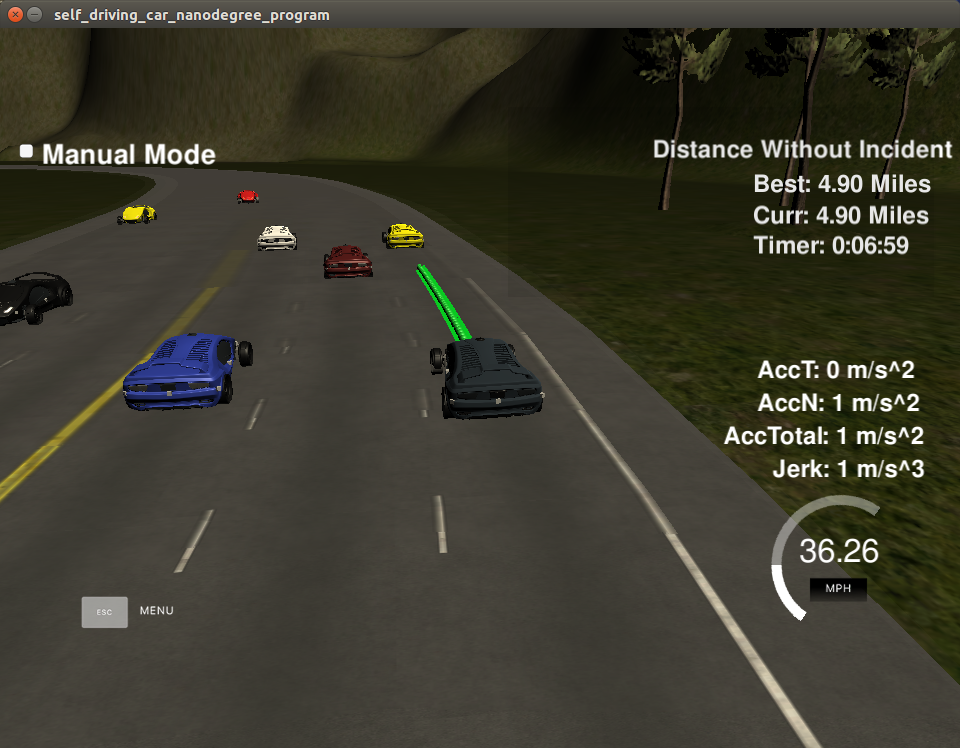

# CarND-Path-Planning-Project
Self-Driving Car Engineer Nanodegree Program
   
## Overview
### Goals
In this project your goal is to safely navigate around a virtual highway with other traffic

## Project video

## Project Specification
### Compilation
1. The updated file: 'main.cpp': I didn't use the cost function to choose better path. I set manually. If there is the front car, the car will change the line. The distance threshold between two cars for lane changing also set manually. 
2. Folder: 'build'

### Valid Trajectories
1. The car is able to drive at least 4.32 miles without incident. (o)

2. The car drives according to the speed limit. (o)
   1. I set _'ref_vel = 49.5'_ to control the fastest speed. 
   2. If the front car is too close (<30), the car should slow down.
   
3. Max Acceleration and Jerk are not Exceeded. (o)

4. Car does not have collisions.(o)
   1. In previous experiment, the crash sometimes happened in lane changing. I set  _'if(((check_car_s_nearby-car_s)<20) && ((check_car_s_nearby-car_s)>-20))'_,_'{lane_safe = false;}'_ for preventing that the car hit the car behind it.  
   
5. The car stays in its lane, except for the time between changing lanes.
   1. Once the car stay outside of its lane (eg. staying on the line, not stay in its lane.). Because I thought when the car is  slowing down, that means there is a car bars the front road. So, when the speed of the car < 48, I set _'change_lane = true'_. It causes that the frequency of changing lane is too high, so the car stay on the lane a long time.    
   
6. The car is able to change lanes(o)

### There is a reflection on how to generate paths
1. The code can seperate in three part. First part: line 45~161. Second part: line 163~385. Third part: 394~518.

2. First part: Define 5 useful functions.
   1. _distance()_: calculate Euclidean distance between two point in Cartesian x and y coordinate.
   2. _ClosestWaypoint()_: output the index(i) of the vehicle which is the cloest to the current car. the _distance()_ function is used in here. 
   3. _NextWaypoint()_: get the next waypoints frim closest waypoint.
   4. _getFrenet()_: transfer Cartesian x and y cooradinate into Frenet s and d cooradinate.
   5. _getXY()_: transfer Frenet s and d cooradinate into Cartesian x and y cooradinate.
   
3. Second part: 
   1. __Read the waypoint data__. 
      1. Read the waypoint file from'.. data/highway_map.csv', make sure it has data. 
      2. Read the waypoint data line by line and define as 'x, y, s, d_x, d_y', and then save to ' map_waypoints_x, map_waypoints_y, map_waypoints_s, map_waypoints_dx, map_waypoints_dy' (line 182~195)
   2. __Get the current car's localization(x and y), yaw angle and speed__.(line 163~385)
      1. Save the main car's localization data from data into program. (line 226~256)
      2. calculate the car's next waypoint information using function _'NextWaypoint()'_.
         1. If the previous_path size is too small, I use the current location and yaw angle(car_x, car_y, car_yaw) and start point to get next waypoint(next_wp).
         2. If the previous_path size is enough, I use the (current location - previous location) to get yaw angle.
         3. Get the current car speed. Because car's path made up of (x,y) points that the car will visit sequentially every .02 seconds, so the speed need to divide by 0.02. (line 279)
         4. Get the other car's information from sensor_fusion(line 291). In line 291, _‘sensor_fusion.size()’_ is the number of car in the map. And then we calculate each car's location and speed, which save as 'vx, vy, check_speed, check_car_s'.
         5. (line 305-321) If (1)the check car s bigger than the current car s (2)__the distance between two car smaller than 30__ and (3) distance between two car smaller than _'closestDist_s'_, I set 'change_lanes = true'. also, __If the (20 < distance <30), change the current car's speed to the front car's speed; If the (distance < 20) , the current car need to slow down.__ Also, I use _'if(d<(2+4*lane+2) && d>(2+4*lane-2))'_ to make sure the check cars locate in the same lane with the current car.
         6. (line 324~386) If the current cars is too close with front car _'change_lanes = true'_, the current car need to __change lane__. In here, I code for two situation seperately. Because if the current lane = 0, the car can not change to left lane; Also if the current lane = 2, the car can not change to right lane.
            1. Situation 1: when the current lane != 2. It means that the lane = 0 or 1. So the car need to change to right lane. I use _'if(d_nearby<(2+4*(lane+1)+2) && d_nearby>(2+4*(lane+1)-2))'_ to check the car that locate in right-side lane. Compare the distance between the checked car and current car using _'if(((check_car_s_nearby-car_s)<20) && ((check_car_s_nearby-car_s)>-20))'_. If there are cars in front or back-side in 20 meters, the current car can not change the lane. 
            2. Situation 1: when the current lane != 0. It means that the lane = 1 or 2. So the car need to change to left lane. I use _'if(d_nearby<(2+4*(lane-1)+2) && d_nearby>(2+4*(lane-1)-2))'_ to check the car that locate in left-side lane. Compare the distance between the checked car and current car using _'if(((check_car_s_nearby-car_s)<20) && ((check_car_s_nearby-car_s)>-20))'_. If there are cars in front or back-side in 20 meters, the current car can not change the lane. 
   3.  __Push the next point__ 
